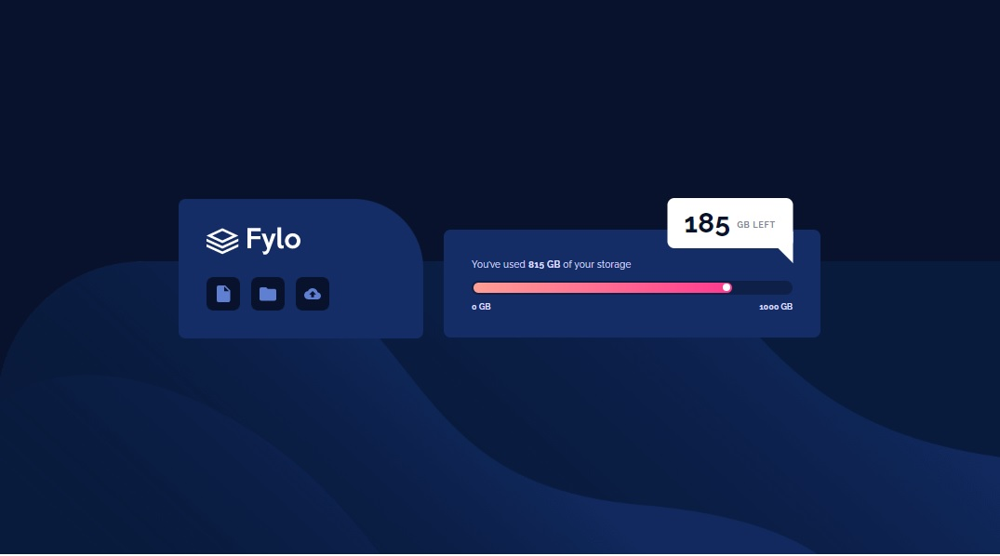
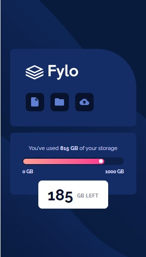

# Frontend Mentor - Fylo data storage component solution

This is a solution to the [Fylo data storage component challenge on Frontend Mentor](https://www.frontendmentor.io/challenges/fylo-data-storage-component-1dZPRbV5n). Frontend Mentor challenges help you improve your coding skills by building realistic projects.

## Table of contents

- [Overview](#overview)
  - [The challenge](#the-challenge)
  - [Screenshot](#screenshot)
  - [Links](#links)
- [My process](#my-process)
  - [Built with](#built-with)
  - [What I learned](#what-i-learned)
  - [Continued development](#continued-development)
  - [Useful resources](#useful-resources)
- [Author](#author)
- [Acknowledgments](#acknowledgments)

## Overview

### The challenge

Users should be able to:

- View the optimal layout for the site depending on their device's screen size

### Screenshot

| Desktop layout |
| :------------: |



| Mobile layout |
| :-----------: |



### Links

- Solution URL: [Add solution URL here](https://your-solution-url.com)
- Live Site URL: [Add live site URL here](https://your-live-site-url.com)

## My process

### Built with

- Semantic HTML5 markup
- CSS custom properties
- Flexbox
- Mobile-first workflow
- Sass

### What I learned

This is my #2 solution of this challenge. In #1 I used \<progress> tag to code the progress bar, this time I used \<div>s, and Sass. The storage information is also loaded from a JavaScript file, I think the data would come from some sort of a backend.

- #### Progress bar
  Using \<div>s it is much easier to style the progress bar and the white dot.

```html
<div class="progress-bar">
  <div id="progress-value" class="progress-value">
    <div class="dot"></div>
  </div>
</div>
```

- #### The progress value width
  I set the width of the progress value by updating a custom variable --width.

```js
const progressValue = document.getElementById("progress-value");
progressValue.setAttribute(
  "style",
  `--width: ${(used / availableStorage) * 100}%`
);
```

- #### Progress value animation
  This time I added an animation to the progress value. I used the --width custom variable again to specify the end of the animation

```css
@keyframes progress {
  0% {
    width: 1rem;
  }
  100% {
    width: var(--width, 0);
  }
}
```

- #### Reduced motion
  If user prefers reduced motion, I also added a rule disabling the animation. There is a nice article about in on web.dev blog.

```css
@media (prefers-reduced-motion: reduce) {
  .progress-value {
    animation: none;
  }
}
```

- #### Link or button?
  I decided to code the buttons as buttons, not links as in #1 solution. I found a nice article on FreeCodeCamp. They could be assigned to appropriate action by JavaScript.

### Continued development

I would like to continue to code challenges pretending it is a part of a real website - as far as my current knowledge goes. Adding more problems and solve challenges in different ways helps me a lot. I would also like to focus on best practice, semantic HTML and accessibility.

### Useful resources

- [CSS Progress Bar Tutorial](https://youtu.be/basf1lH1H-E) - a YouTube video by WDS, Kyle's another great tutorial
- [prefers-reduced-motion: Sometimes less movement is more](https://web.dev/prefers-reduced-motion/) - on web.dev blog
- [HTML Button onclick – JavaScript Click Event Tutorial](https://www.freecodecamp.org/news/html-button-onclick-javascript-click-event-tutorial/) article on FreeCodeCamp

## Author

- Website - [My portfolio](https://pavlinaps.github.io/my-portfolio/)
- Frontend Mentor - [@PavlinaPs](https://www.frontendmentor.io/profile/PavlinaPs)
- Twitter - [@PPsarsky](https://www.twitter.com/PPsarsky)

## Acknowledgments

It is great that I can solve Frontend Mentor's challenges. They are all very useful for me. Every single one. Thank you!
